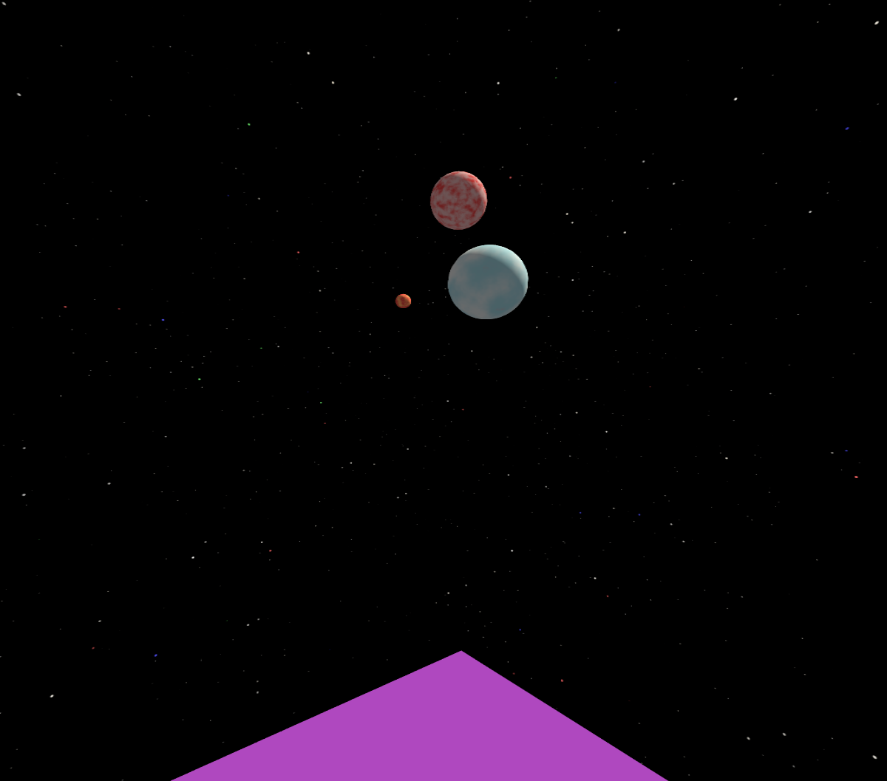
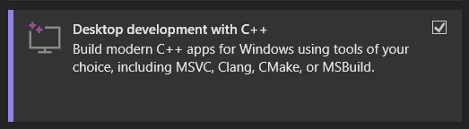
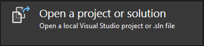

# GENERACIO-OpenSource
## Introduction to GENERACIO
**GENERACIO** is a project that aims to make VR (primarily PCVR) more accessible.
Here you can track my progress, from building my own VR game engine to developing VR hardware.
This is the open-source version of the project, meaning only selected parts of my work are published here.

## Introduction to GENERACIO-OpenSource
This repository contains all the tools I've been working on for my project **GENERACIO**.
All of the code is open-source and free to use in your own project.

You can also help develop the project by creating a pull request!
 
## Current progress
+ A lightweight, extensible OpenGL/OpenXR engine in C++ **(KI ENGINE)**
+ A program meant to link together the engine, drivers and hardware **(GENERACIO App)**

## KI ENGINE
Serves as an OpenGL and OpenXR example VR game engine, can be built upon!



I recommend using **SteamVR** as the OpenXR runtime.
If you don't have a VR headset, but still want to test the code, use a [Dummy HMD](https://github.com/username223/SteamVRNoHeadset).
If you're using Visual Studio, make sure to set it to **Release x64** before building!

### Installation
This guide assumes you're on a 64-bit Windows 11 installation. Proceed accordingly.

1. First, if you haven't, download Visual Studio: https://visualstudio.microsoft.com/downloads/
2. Then, install the following:



3. Open up a Terminal window and download the latest version of the project: `git clone https://github.com/FortHell/GENERACIO-OpenSource.git`
4. Then run these commands:
```
git clone https://github.com/microsoft/vcpkg.git

cd vcpkg

.\bootstrap-vcpkg.bat

.\vcpkg integrate install

.\vcpkg install glad glfw3 openxr-loader glm
```
5. In Visual Studio, click on this:



6. Go to where you cloned the project files, go inside the KI ENGINE folder, and select "Project_KI_ENGINE.sln".
7. Don't forget to change the config (near top of the window) from Debug x86 to Release x64.
8. Make sure you have SteamVR installed and your headset plugged in before running any code! Edit `main.cpp` - that's the main script.
