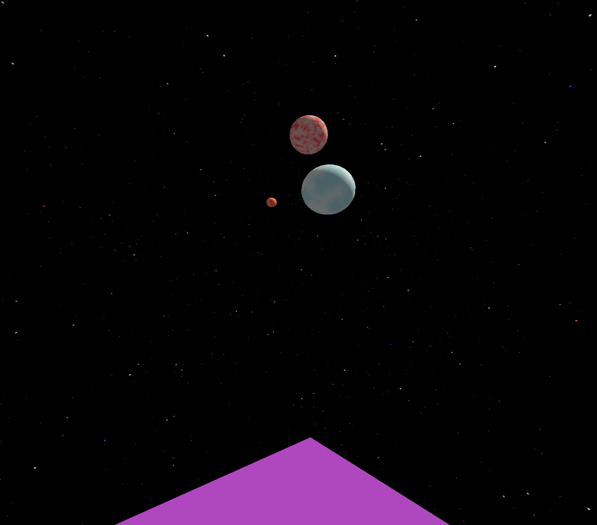

# GENERACIO-OpenSource
## Introduction to GENERACIO
**GENERACIO** is a project that aims to make VR (primarily PCVR) more accessible.
This is the open-source version of the project, meaning only selected parts of my work are published here.

## Introduction to GENERACIO-OpenSource
This repository contains all the tools I've been working on for my project **GENERACIO**.
All of the code is open-source (MIT) and free to use in your own project.

Contributions are welcome. Fork the repo, and submit a PR.
 
## Current progress
+ A lightweight, purpose-built OpenGL/OpenXR engine in C++: **(KI ENGINE)**
+ A program that links the engine, drivers and hardware together: **(GENERACIO App)**

## KI ENGINE
Serves as an OpenGL and OpenXR VR engine, can be built upon!



I recommend using **SteamVR** as the OpenXR runtime on Windows, and **Monado (via Envision)** or **WiVRn** on Linux.
If you don't have a VR headset, but still want to test the code, use the [Null Driver](https://github.com/username223/SteamVRNoHeadset) on **SteamVR (Windows)** and use [these settings](media/envision_1.png) on **Envision**.
If you're using Visual Studio, make sure to set it to **Release x64** before building!

### Installation
This guide is for Windows 11. Though, most of these will work on Linux, with minor differences.

1. Clone the repository: `git clone https://github.com/FortHell/GENERACIO-OpenSource.git`
2. Then run these commands (skip vcpkg installation if you already have it, or use a different solution):
```
git clone https://github.com/microsoft/vcpkg.git

cd vcpkg

.\bootstrap-vcpkg.bat

.\vcpkg integrate install

.\vcpkg install glad glfw3 openxr-loader glm
```

3. Open the project. If you're using Visual Studio, open the solution file instead.
4. Don't forget to change the config to Release x64.
5. Make sure you have SteamVR or Monado + Envision installed and your headset plugged in before running any code! Edit `main.cpp` - that's the main script.
